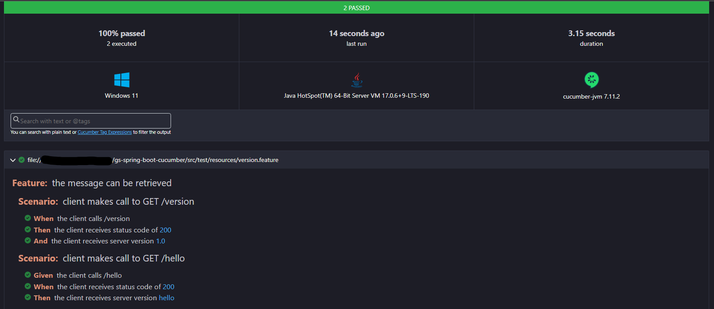

# gs-spring-boot-cucumber

Run cucumber integration tests in spring boot application.

## Run Cucumber tests

```shell
gradle clean cucumberRun

```

See test reports inside `build/cucumber-report.html`

